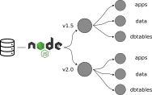

[](https://www.bestpractices.dev/projects/9788)
 [](https://zenodo.org/badge/latestdoi/91914528)

[](https://nsf.gov/awardsearch/showAward?AWD_ID=1550707) [](https://nsf.gov/awardsearch/showAward?AWD_ID=1541002) [](https://nsf.gov/awardsearch/showAward?AWD_ID=2410961)

# Neotoma API Implementation

This repository is intended to act as the core repository for the Neotoma API version 1.5 and greater.  The API acts as an interface between a user application and the Neotoma Postgres Database. This separation helps improve security, and lowers the data access barrier to users by providing simple URL paths, rather than requiring users to create individual SQL queries.


**Image Credits**: All images from the Noun Project (CC BY 3.0) -- API by SAM Designs; Database by Lewen Design; People by iconixr.

For documentation of the Neotoma Paleoecology Database see [the user manual](http://neotoma-manual.readthedocs.io/en/latest/neotoma_introduction.html) and for more information about the Neotoma community, see the [Neotoma webpage](https://www.neotomadb.org/).  Version 1 of the API is now fully deprecated and no longer resolves.

## Development

* [Simon Goring](http://goring.org): University of Wisconsin - Madison [](https://orcid.org/0000-0002-2700-4605)
* Mike Stryker: Pennsylvania State University

## Project Structure

This codebase is generated using [`node.js`](https://nodejs.org), [`express`](https://expressjs.com/) and [`pg-promise`](https://vitaly-t.github.io/pg-promise/) to interact with the Neotoma PostgreSQL database. The API endpoints are organized conceptually by applications (apps), data, and direct access to specific tables (dbtables). This project is based on and replaces an existing API implemented with .NET and SQLServer.

The API is structured to support ongoing development with new API endpoint versions, while supporting backwards compatibility by retaining older versions of the API endpoints.



Each API version (v1.5, v2.0) has a set of sub-paths, including `apps`, `data` and `dbtables`. Most individual consumers of the API products will connect using the `data` endpoints. These are the endpoints that resolve to comprehensive data objects with rich metadata. The `apps` endpoints are intended to support very specific calls to support application developers, for example, endpoints used specifically in the [Neotoma Landing Pages](https://data.neotomadb.org) to return general statistics about the database. The `dbtables` endpoints return subsets of Neotoma database tables (see the [database documentation](https://open.neotomadb.org/manual) or the [database schema representation](https://open.neotomadb.org/dbschema)).

### Project Documentation

Documentation uses the [OpenAPI standard](https://www.openapis.org/). Currently [https://api.neotomadb.org](https://api.neotomadb.org) is the home for the API, and will resolve to an [OpenAPI](https://www.openapis.org/) landing page with API documentation and search functionality. The documentation is generated dynamically from the [openapi.yaml](openapi.yaml) yaml file using the OpenAPI standard.

The full yaml file is over 3000 lines long. To help with maintainability each sub-component is found within the [`openapi`](./openapi/) folder, further subdivided by version number, path, and parameters. The JavaScript file [`build-openapi.js`](./openapi/scripts/build-openapi.js) is used to compile these files together using the [OpenAPI template](./openapi/openapi-template.yaml), saving it as `openapi.yaml`. A user can automatically re-build the OpenAPI documentation using:

```bash
yarn run build:openapi
```

The final `openapi.yaml` is the file that is used for documentation and for testing.

### Testing

Tests for the API are implemented using mocha/chakram and also make use of [`oatts`](https://github.com/google/oatts), which generates tests directly from the [openapi.yaml](openapi.yaml) documentation.

To autogenerate the test suite (in the `tests/` folder), we use the bash script `genoatt.sh`, which provides base-level implementation of the `oatts` module, along with some fixes to modify values in the testing suite to ensure consistency with the API.  Once the tests have been generated we use `runmochabatch.sh` which tests each module and returns an HTML file (placed in the `public/` folder) that can be used to examine individual structural errors in the API (or documentation).

To generate the tests we can directly call:

```bash
bash genoatt.sh
```

Or, we can use the `yarn` call:

```bash
yarn run validate:openapi
```

Which will re-build the tests and then execute the `mocha` test suite, generating two files: [`public/tests.html`](https://api.neotomadb.org/tests.html) and [`public/tests.json`](https://api.neotomadb.org/tests.json). These contain summaries of the test results, and error information that can be used in improving the API.

## Contribution

We welcome user contributions to this project.  All contributors are expected to follow the [code of conduct](https://github.com/Neotomadb/api_nodetest/blob/master/code_of_conduct.md).  Contributors should fork this project and make a pull request indicating the nature of the changes and the intended utility.  Further information for this workflow can be found on the GitHub [Pull Request Tutorial webpage](https://help.github.com/articles/about-pull-requests/).

## Local Development

### Connection File

Along with the files in this repository a user will need a file called `.env`, to be located in the main directory. We include a `.env-template` file for convenience.

```bash
NODE_ENV=development
APIPORT=3001
RDS_HOSTNAME=localhost
RDS_USERNAME=your_postgres_username
RDS_DATABASE=neotoma
RDS_PASSWORD=your_postgres_password
RDS_PORT=your_postgres_port
LOCALLIMIT=false
SSL_CERT=true
NATIVELANDKEY=your_key_for_native-lands.ca
```

Enter your secure information into the `.env-template` file, and then save it as `.env` to enable your connection to the Neotoma Database.

### Local Development

The code in this repository is run directly against the production database on the Neotoma servers at the Center for Environmental Informatics at Penn State.  It is possible to run this repository on a local server (on your own machine) or on a remote server (using cloud services or a university server) by installing Postgres and restoring one of the [Neotoma Database Snapshots](https://www.neotomadb.org/snapshots).  If you are planning to run the application in this way, please ensure that you have set appropriate security measures, and have these documented in the `.env` file, as described below.

### To Run

To start the server locally you must first clone the repository.  Once the repository is cloned you must use the `yarn` package installer to download the required packages.  The required packages are listed in `package.json`.  You can use the command `yarn install` to install the packages locally.

Once the directory is set up and the packages have been installed, use `yarn run start` to start the server locally.  This will create a local server, serving data to `localhost:3001`.

```
$ yarn start

> api-nodetest@0.0.0 start /home/simon/Documents/GitHub/api_nodetest
> node ./bin/www
```

Using a tool like `nodemon` may make ongoing development easier, as it will reload the application following changes to the code.

### Adding or Editing an API Endpoint

The current API reflects the needs of certain users who have directly communicated their needs to the development team.  Future users, or groups may wish to support services from Neotoma that are currently not implemented.  Adding a new service to the API should be done in a new fork of the repository, and includes the following steps:

#### Start with the Documentation

Because we have made building tests from the documentation a core part of this application, we suggest the user first add to the various `yaml` files, to clearly identify their goals for the new API endpoint.

* What data do you want from the database?
* What information will the user pass to filter the request?
* How will the data be structured?
* What will an error look like?

You will add an entry to [`openapi/paths/v20/apps.yaml`](openapi/paths/v20/apps.yaml) to indicate what URL we will use to access the data. There you define the parameters used in the request. You define the response in [`openapi/components/schemas/schemas.yaml`](openapi/components/schemas/schemas.yaml). Where possible, please use pre-existing components.

Once you have fully documented your new path and its responses you should be able to execute:

```bash
yarn run build:openapi
yarn run validate:openapi
```

This will run the tests for your newly defined endpoint. Errors in formatting will get picked up early, in the `build:openapi` step. The `validate:openapi` step should show that your new path is in error, since we have not defined any path within the API itself yet.

#### Add the `route`

Within each version there is a `routes` folder. This defines the paths that the API itself will recognize. Given the path you defined in the `yaml` file, you will enter a new line such as:

```js
router.get('/example', handlers.examplefunc);
```

We assume that `v2.0` is prepended to the path (since we're in that folder), we define the *verb* (generally `GET`), and we identify the function that the `handler` will use to request and return the data. In this case we will be telling the router to run the function `examplefunc()` every time someone comes to `https://api.neotomadb.org/v2.0/example`

#### Define the `handler`

Now that we have defined how to get to the data, we have to tell the API where the function is. This is (to some degree) an extra step that is not neccessary, but it is a product of this legacy codebase. Within the `handlers` folder, you will add a new function with the same name as above:

```js
  examplefunc: function(req, res, next) {
    const examples = require('../helpers/examples/example.js');
    examples.examplefunc(req, res, next);
  }
```

This points us towards our next step. When we write our new function to actually get the data, we need to decide where to put the code. For that, we use the `helpers` folder, and we try to organize it by identifying which kinds of data are being accesed. For our `example` function, we're going to put it in a folder called `examples`, and that `example.js` file will have to export a function called `examplefunc()`.

#### Create a `helpers` folder

Your new service, for example `example`, will have its own folder in the [`helpers`](https://github.com/NeotomaDB/api_nodetest/tree/master/v2.0/helpers) folder.  This is to ensure that all the resources are kept well organized in one place.  In general that folder will contain a `js` file (`example.js`) and a SQL file, that will directly query the database (`example.sql`).

If the query is very simple (a simple `SELECT * FROM xxx.xxxxx` query), it is possible to use only a `js` file, as in [`helpers/frozen/frozen.js`](https://github.com/NeotomaDB/api_nodetest/blob/master/v2.0/helpers/frozendata/frozen.js#L9).

The existing files and folders in the `helpers` directory can easily be used as a template for new API endpoints.  Feel free to make changes to the code.  In particular, if there are new endpoints required, or changes in the way data are returned or documentation is provided, please let us know, or [contribute directly](CONTRIBUTING.md).

### Final Thoughts on Development

As you develop your code, get used to a process of iterative development. Document first, keep the API running using `nodemon`, and start simple. Test often using `yarn run validate:openapi`, and switch back and forth to the terminal running `nodemon` to look at the error messages, as well as the output in `tests.html`.

## Funding

This work is funded by NSF grants to Neotoma: NSF Geoinformatics - [1550707](https://www.nsf.gov/awardsearch/showAward?AWD_ID=1550707&HistoricalAwards=false)/[1948926](https://www.nsf.gov/awardsearch/showAward?AWD_ID=1948926&HistoricalAwards=false)/[2410961](https://nsf.gov/awardsearch/showAward?AWD_ID=2410961) and NSF EarthCube [1541002](https://www.nsf.gov/awardsearch/showAward?AWD_ID=1541002&HistoricalAwards=false).
